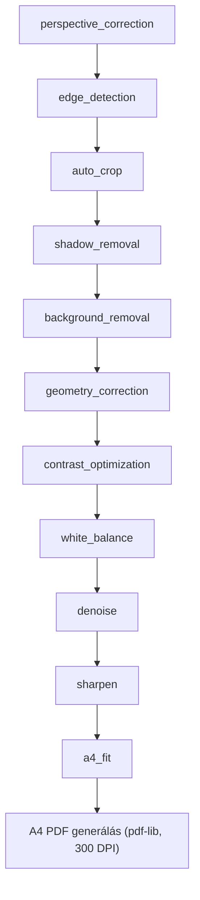
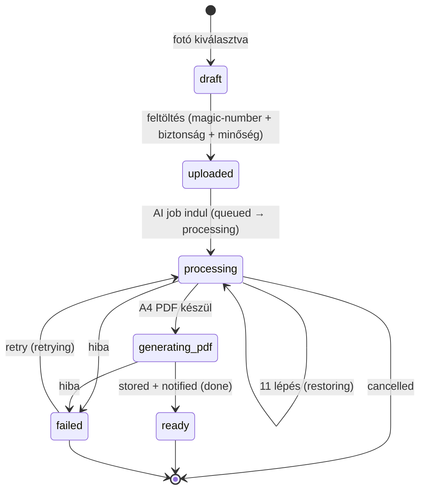

# AI dokumentáció – Vallordocs

> Forrás: `src/modules/ai/` (PRD 3. fejezet – AI feldolgozási folyamat,
> Dokumentum hitelesség). Alapelv: az AI **kizárólag a láthatóságot** javítja,
> a **tartalmat soha** nem módosítja. A kimenet mindig hiteles másolat marad.

## Cél

A sofőr mobillal lefotózza a fuvardokumentumot; a rendszer professzionális,
szkennelt minőségű A4 PDF-et készít belőle – perspektívajavítással,
árnyékeltávolítással, kontrasztoptimalizálással – a tartalom megváltoztatása
nélkül.

## Provider pattern

Az alkalmazás soha nem függ közvetlenül egy konkrét AI-szolgáltatótól, hanem az
**`AiProvider` interfészre** (`src/modules/ai/types.ts`). A provider-váltás
konfiguráció (`AI_PROVIDER` env), nem kódmódosítás.

- **`gemini-provider.ts`** – az egyetlen implementált provider (M3). Injektált
  `GeminiTransport`, ami teljes unit-tesztelhetőséget ad; alapmodell
  `gemini-2.0-flash`.
- A `factory.ts` a konfiguráció alapján adja vissza a providert; stub státusz:
  `openai`, `claude`, `vertexai` (az `AiProvider` enum ismeri őket, de csak a
  `gemini` implementált).

Minden AI-futás egy `AiJob` sorba kerül; a job hordozza a `provider`, `model`,
`promptVersion`, `durationMs`, `tokensUsed`, `attempts` mezőket (lásd
[DATABASE.md](DATABASE.md)).

## 11 lépéses helyreállítási pipeline

A `pipeline.ts` a lépéseket **adatként** deklarálja, hogy az orchestrátor, a
provider-prompt és a UI-státuszcímkék egyetlen igazságforrásból dolgozzanak
(`RESTORATION_STEPS`, sorrendhelyesen):

1. `perspective_correction` – perspektívajavítás
2. `edge_detection` – éldetektálás
3. `auto_crop` – automatikus körbevágás
4. `shadow_removal` – árnyékeltávolítás
5. `background_removal` – háttéreltávolítás
6. `geometry_correction` – geometriai korrekció
7. `contrast_optimization` – kontrasztoptimalizálás
8. `white_balance` – fehéregyensúly
9. `denoise` – zajszűrés
10. `sharpen` – élesítés
11. `a4_fit` – A4 illesztés

## Hitelesség guardrail-ek

A `guardrails.ts` a megengedett és tiltott műveleteket konstansként rögzíti, és
ezekből fordítja le a **rendszer-promptot** a vision modellhez
(`buildRestorationSystemPrompt`). Prompt-verzió: `restore-v1`
(`RESTORATION_PROMPT_VERSION`, minden job-ra rögzítve).

### Megengedett (csak vizuális megjelenés) – `ALLOWED_ADJUSTMENTS` (11)

`perspective`, `noise`, `shadow`, `background`, `lighting`, `white_balance`,
`slight_blur`, `slight_distortion`, `page_edges`, `auto_crop`,
`document_alignment`.

### Tiltott (tartalommódosítás) – `FORBIDDEN_MODIFICATIONS` (8)

`inventing_characters`, `correcting_numbers`, `changing_dates`,
`regenerating_handwriting`, `altering_signatures`, `altering_stamps`,
`inventing_missing_parts`, `completing_unreadable_data`.

> **Szabály:** ha bármely adat olvashatatlan, olvashatatlan marad. A modell soha
> nem talál ki, egészít ki, javít vagy generál újra karaktert, számot, dátumot,
> kézírást, aláírást vagy pecsétet.

## Dokumentum feldolgozási állapotok

A `PROCESSING_STAGES` az end-to-end folyamat állomásai: `uploaded →
quality_checked → restoring → generating_pdf → stored → notified`.

## Dokumentum életciklus diagram

Az `AiJobStatus` / `DocumentStatus` állapotokon keresztül:

Megjegyzés: a `Document.status` (`draft/uploaded/processing/ready/failed`) és az
`AiJob.status` (`queued/processing/generating_pdf/done/failed/retrying/cancelled`)
párhuzamosan követi a folyamatot; a `Document.aiStatus` tükrözi az aktuális job
állapotot. A státuszváltásokra a `notifications` modul értesítést képez
(`done→success`, `failed→error`, `retrying/cancelled→warning`).

## Dokumentum-előfeldolgozás (documents modul)

Az AI elé a `documents` modul kapuz:

- **`magic-numbers.ts`** – a valódi bájtokból ismeri fel a típust (JPEG/PNG/PDF/
  HEIC/WEBP), soha nem a kiterjesztésből vagy a deklarált MIME-ból.
- **`file-security.ts`** – 9 issue-típus (pl. dupla kiterjesztés, MIME-eltérés,
  kiterjesztés–tartalom eltérés).
- **`quality.ts`** – numerikus küszöbök (min. 1000 px, élesség ≥ 0.35, fényerő
  0.2–0.9); egyesíti az eszközön észlelt flag-eket, deduplikál.
- **`pdf.ts`** – többoldalas A4 PDF (`pdf-lib`), 300 DPI cél, aspect-ratio
  megőrzéssel, középre igazítva.

## Konfiguráció

| Env              | Jelentés                                                       |
| ---------------- | -------------------------------------------------------------- |
| `AI_PROVIDER`    | `gemini` (implementált) \| `openai`/`claude`/`vertexai` (stub) |
| `GEMINI_API_KEY` | Google AI Studio API kulcs                                     |

## Kapcsolódó

- [STORAGE.md](STORAGE.md) – hova kerülnek a variánsok (original/processed/pdf)
- [DATABASE.md](DATABASE.md) – `AiJob`, `Document`, `DocumentVersion`
- [OBSERVABILITY.md](OBSERVABILITY.md) – AI sikerességi arány, feldolgozási idő
