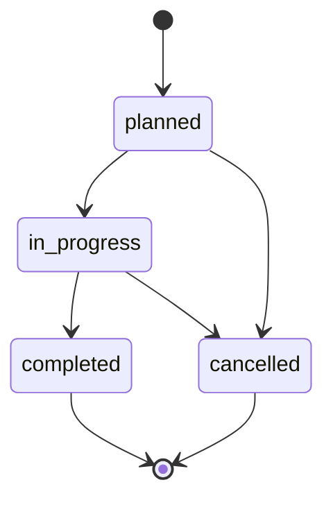

# API dokumentáció (v1 szerződés) – Vallordocs

> **Állapot:** az API-réteg (route-ok, Server Actions) párhuzamosan épül. Az
> alábbi az **v1 tervezett szerződés**, a modulfelelősségekből
> (`src/modules/README.md`) és az adatmodellből (`prisma/schema.prisma`)
> levezetve. Ténylegesen bekötve jelenleg a `GET /api/health` van (lásd
> [OBSERVABILITY.md](OBSERVABILITY.md)); minden más végpont **INTENDED** (még
> nem drótozott) jelöléssel szerepel.

## Konvenciók

- **Base URL:** `https://vallordocs.fly.dev` (prod), `http://localhost:3000`
  (dev).
- **Formátum:** JSON kérés/válasz; fájlfeltöltés `multipart/form-data`.
- **Hitelesítés:** `Authorization: Bearer <accessToken>` (15 perces access
  JWT). A megújítás refresh tokennel történik – lásd [AUTH.md](AUTH.md).
- **Tenant-scope:** minden erőforrás a hívó tenantjára szűrődik (`tenantScope`),
  és `assertSameTenant` véd az IDOR ellen. A `platform_owner` kivétel.
- **Jogosultság:** minden végpont szerver oldalon `requirePermission`-t hív. A
  jogosultságkulcsok: [PERMISSIONS.md](PERMISSIONS.md).
- **Lapozás:** lista-végpontok `?page`, `?pageSize` (alap 20, max 100), és a
  válasz `{ items, page, pageSize, total }` alakú.

### Egységes hibaformátum

```json
{ "error": { "code": "forbidden", "messageKey": "errors.forbidden" } }
```

A felhasználó csak biztonságos, fordítható üzenetkulcsot lát; a részletes
kivétel csak logban jelenik meg (nincs stack trace / SQL / útvonal / API kulcs).

### Hibakódok

| HTTP | `code`         | Mikor                                               |
| ---- | -------------- | --------------------------------------------------- |
| 400  | `validation`   | Zod validáció bukott / rossz állapotátmenet         |
| 401  | `unauthorized` | Hiányzó/érvénytelen/lejárt access token             |
| 403  | `forbidden`    | Nincs meg a szükséges permission, vagy másik tenant |
| 404  | `not_found`    | Erőforrás nem létezik (vagy más tenanté – IDOR)     |
| 409  | `conflict`     | Egyediség-ütközés / verzió-konfliktus               |
| 429  | `rate_limited` | Rate limit túllépve (login/upload/ai/api)           |
| 500  | `internal`     | Nem várt szerverhiba (részletek csak logban)        |
| 503  | `unavailable`  | Health `down`                                       |

---

## Auth — `/api/auth`

| Metódus | Útvonal             | Permission        | Leírás                                             |
| ------- | ------------------- | ----------------- | -------------------------------------------------- |
| POST    | `/api/auth/login`   | – (nyilvános)     | Belépés e-mail + jelszóval; access + refresh token |
| POST    | `/api/auth/refresh` | – (refresh token) | Access token megújítása, refresh rotáció           |
| POST    | `/api/auth/logout`  | Bearer            | Aktuális refresh token revokálása                  |

**POST /api/auth/login** — Kérés: `{ "email": string, "password": string }`.
Válasz `200`: `{ "accessToken": string, "refreshToken": string, "user": {...} }`.
Hibák: `401` (rossz hitelesítő), `429` (brute-force limit).

**POST /api/auth/refresh** — Kérés: `{ "refreshToken": string }`. Válasz `200`:
`{ "accessToken": string, "refreshToken": string }` (rotált). Hibák: `401`
(érvénytelen/revokált/lejárt).

**POST /api/auth/logout** — Kérés: `{ "refreshToken": string }`. Válasz `204`.

---

## Me / profil — `/api/me`

| Metódus | Útvonal                         | Permission | Leírás                                        |
| ------- | ------------------------------- | ---------- | --------------------------------------------- |
| GET     | `/api/me`                       | Bearer     | Aktuális felhasználó profilja + szerepek      |
| PATCH   | `/api/me`                       | Bearer     | Self-service profil (név, telefon, nyelv, tz) |
| GET     | `/api/me/devices`               | Bearer     | Aktív munkamenetek/eszközök listája           |
| POST    | `/api/me/devices/logout-others` | Bearer     | Kijelentkezés minden más eszközről            |

A `selfProfileSchema` validál; az aktuális munkamenet egyedileg nem revokálható.

---

## Users — `/api/users`

| Metódus | Útvonal           | Permission    | Leírás                          |
| ------- | ----------------- | ------------- | ------------------------------- |
| GET     | `/api/users`      | `user.manage` | Tenant felhasználók (lapozott)  |
| POST    | `/api/users`      | `user.manage` | Új felhasználó meghívása        |
| GET     | `/api/users/{id}` | `user.manage` | Egy felhasználó                 |
| PATCH   | `/api/users/{id}` | `user.manage` | Profil/szerep/státusz frissítés |
| DELETE  | `/api/users/{id}` | `user.manage` | Soft delete                     |

---

## Drivers — `/api/drivers`

| Metódus | Útvonal             | Permission     | Leírás             |
| ------- | ------------------- | -------------- | ------------------ |
| GET     | `/api/drivers`      | `driver.read`  | Sofőrök (lapozott) |
| POST    | `/api/drivers`      | `driver.write` | Új sofőr           |
| GET     | `/api/drivers/{id}` | `driver.read`  | Egy sofőr          |
| PATCH   | `/api/drivers/{id}` | `driver.write` | Frissítés          |
| DELETE  | `/api/drivers/{id}` | `driver.write` | Soft delete        |

A `driverCode` normalizálódik (trim + uppercase + belső whitespace törlés),
majd a `^[A-Z0-9-]{2,32}$` mintára illeszkedik.

---

## Trips — `/api/trips`

| Metódus | Útvonal                  | Permission   | Leírás                       |
| ------- | ------------------------ | ------------ | ---------------------------- |
| GET     | `/api/trips`             | `trip.read`  | Fuvarok (lapozott, szűrhető) |
| POST    | `/api/trips`             | `trip.write` | Új fuvar                     |
| GET     | `/api/trips/{id}`        | `trip.read`  | Egy fuvar                    |
| PATCH   | `/api/trips/{id}`        | `trip.write` | Adatok frissítése            |
| POST    | `/api/trips/{id}/status` | `trip.write` | Státuszátmenet (állapotgép)  |
| DELETE  | `/api/trips/{id}`        | `trip.write` | Soft delete                  |

Validáció: `arrivalAt ≥ departureAt`.

### Fuvar státusz állapotgép



`POST /api/trips/{id}/status` — Kérés: `{ "to": "in_progress" }`. Nem megengedett
átmenet → `400 validation` (`validation.invalidTripTransition`). A `completed` és
`cancelled` terminális állapotok.

---

## Documents — `/api/documents`

| Metódus | Útvonal                        | Permission        | Leírás                                         |
| ------- | ------------------------------ | ----------------- | ---------------------------------------------- |
| GET     | `/api/documents`               | `document.read`   | Dokumentumok (lapozott, szűrhető)              |
| POST    | `/api/documents`               | `document.write`  | Új dokumentum + fotófeltöltés (multipart)      |
| GET     | `/api/documents/{id}`          | `document.read`   | Egy dokumentum + verziók                       |
| GET     | `/api/documents/{id}/versions` | `document.read`   | Verziólista (original/processed/pdf)           |
| GET     | `/api/documents/{id}/download` | `document.read`   | Aláírt/authorizált letöltés (PDF vagy variant) |
| DELETE  | `/api/documents/{id}`          | `document.delete` | Soft delete                                    |

Feltöltéskor a szerver magic-number alapján ellenőrzi a fájltípust (nem a
kiterjesztésből), biztonsági és minőség-ellenőrzést futtat, majd a dokumentumot
`aiStatus=queued` állapotban rögzíti. Lásd [AI.md](AI.md), [STORAGE.md](STORAGE.md).

---

## AI feldolgozás — `/api/ai`

| Metódus | Útvonal                    | Permission   | Leírás                                     |
| ------- | -------------------------- | ------------ | ------------------------------------------ |
| POST    | `/api/documents/{id}/ai`   | `ai.execute` | AI-helyreállítás indítása (job létrehozás) |
| GET     | `/api/ai/jobs`             | `ai.execute` | AI feladatok listája (lapozott)            |
| GET     | `/api/ai/jobs/{id}`        | `ai.execute` | Egy AI job státusza                        |
| POST    | `/api/ai/jobs/{id}/retry`  | `ai.execute` | Sikertelen job újrapróbálása               |
| POST    | `/api/ai/jobs/{id}/cancel` | `ai.execute` | Folyamatban lévő job leállítása            |

A job státuszok: `queued → processing → generating_pdf → done` (vagy `failed`,
`retrying`, `cancelled`). Rate limit: `ai` policy.

---

## Dashboard — `/api/dashboard`

| Metódus | Útvonal          | Permission      | Leírás                         |
| ------- | ---------------- | --------------- | ------------------------------ |
| GET     | `/api/dashboard` | `document.read` | Aggregált statisztika (tenant) |

Válasz (a `dashboard` modul `buildDashboard`-jából): napi feltöltések, AI
sikerességi arány, átlagos feldolgozási idő, top sofőrök, storage-használat.
Szűrő: `?from`, `?to`.

---

## Notifications — `/api/notifications`

| Metódus | Útvonal                        | Permission | Leírás                       |
| ------- | ------------------------------ | ---------- | ---------------------------- |
| GET     | `/api/notifications`           | Bearer     | Saját értesítések (lapozott) |
| POST    | `/api/notifications/{id}/read` | Bearer     | Olvasottnak jelölés          |
| POST    | `/api/notifications/read-all`  | Bearer     | Minden olvasottnak           |

---

## Settings — `/api/settings`

| Metódus | Útvonal         | Permission        | Leírás                        |
| ------- | --------------- | ----------------- | ----------------------------- |
| GET     | `/api/settings` | `settings.manage` | Tenant beállítások (validált) |
| PUT     | `/api/settings` | `settings.manage` | Beállítások frissítése        |

A kulcsok: AI engedélyezett, PDF minőség, storage limit, dokumentum/audit/log
retenció napok. Ismeretlen kulcsok ignorálva; hiányzók biztonságos defaultra.

---

## Health & Metrics — `/api`

| Metódus | Útvonal        | Permission       | Leírás                                      |
| ------- | -------------- | ---------------- | ------------------------------------------- |
| GET     | `/api/health`  | – (nyilvános)    | **Bekötve.** Health report, `503` ha `down` |
| GET     | `/api/metrics` | – (belső/scrape) | **INTENDED.** Prometheus formátumú metrikák |

Részletek: [OBSERVABILITY.md](OBSERVABILITY.md).

## Feltételezések (v1 szerződés)

- Az útvonalak REST-konvenciót követnek; a UI ténylegesen **Server Actions**-t is
  használhat ugyanezen modul-logikára – a fenti a HTTP-szintű szerződés.
- A jogosultságkulcsokat a tényleges `ROLE_PERMISSIONS` mapből vezettem le
  (`src/modules/auth/rbac.ts`), 13 kulcs.
- A lapozás/`from`/`to` paraméterek nevei a v1 javaslat; a modul-logika (pl.
  `dashboard` range) ezt támogatja.
- A `/api/metrics` Prometheus-scrape-hez a `fly.toml [metrics]` `port=9091 /metrics`
  beállítást tükrözi (app-belső Prometheus registry).
