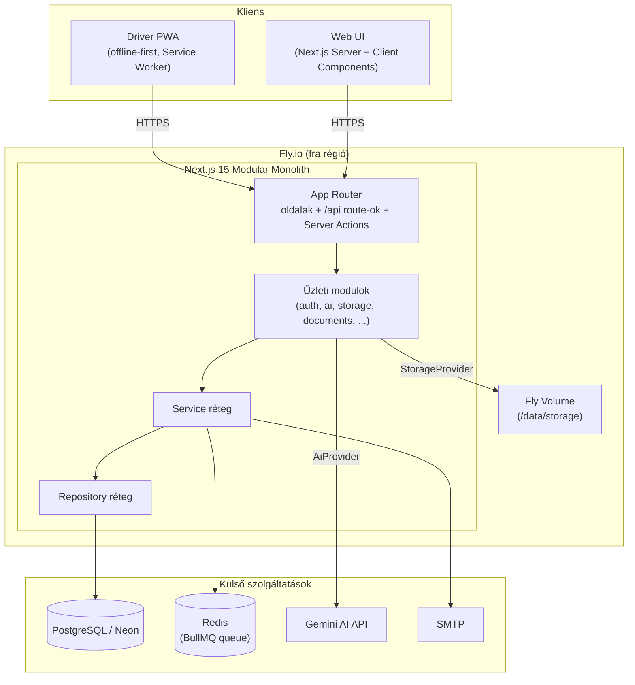
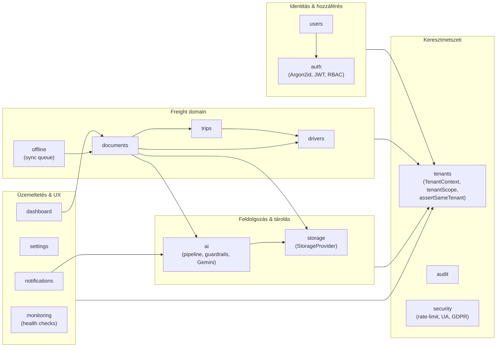
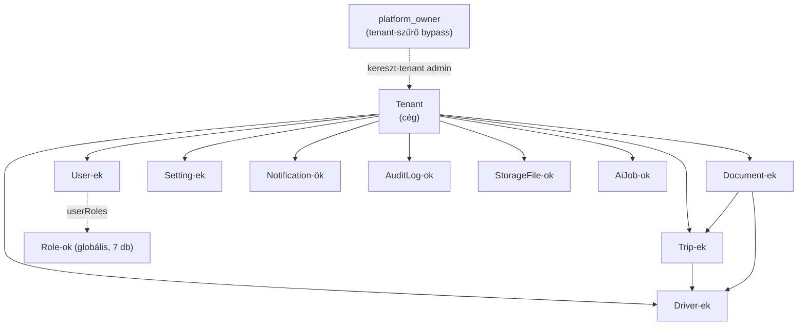

# Architektúra – Vallordocs

> Rendszerarchitektúra áttekintés és diagramok. Forrás: `PRD.md` 1. fejezet
> (Modular Monolith) és `src/modules/README.md`.

A Vallordocs egy **Modular Monolith**: egyetlen Next.js 15 (App Router)
alkalmazásként fut és deployol (Fly.io), de a kód szigorúan üzleti modulokra
van bontva. Nincs elosztott rendszer, nincs mikroszolgáltatás – egy folyamat
szolgálja ki a UI-t, az API-t és a háttérfeldolgozást.

## Alapelvek

- **Clean Architecture** – a rétegek befelé függenek: UI → modul → service →
  repository → adatbázis. A belső réteg nem tud a külsőről.
- **Modular Monolith** – minden modul saját `index.ts` barrelen keresztül
  publikálja a nyilvános API-ját; más modul **kizárólag** ezen keresztül importál.
- **Multi-Tenant** – minden tenant-scope-olt lekérdezés `tenantId` szerint szűr;
  a tenant-izoláció nem megkerülhető biztonsági követelmény.
- **Security by Design** – minden backend művelet a szerveren jogosultságot
  ellenőriz; a frontend ellenőrzés önmagában soha nem elég.
- **AI First / Offline First** – az AI-helyreállítás és az offline-first Driver
  PWA elsőrangú tervezési szempontok.

## Rétegek és felelősségek

| Réteg                 | Hely                                  | Felelősség                                                       |
| --------------------- | ------------------------------------- | ---------------------------------------------------------------- |
| UI / route-ok         | `src/app`                             | App Router oldalak, API route-ok, Server Actions (locale-aware)  |
| Üzleti modulok        | `src/modules/*`                       | Domain-logika, validáció, állapotgépek – tiszta, tesztelhető kód |
| Service-ek            | `src/services`                        | Modulokat orchestráló üzleti folyamatok                          |
| Repository-k          | `src/repositories`                    | Adatelérés; itt (és csak itt) él a nyers Prisma lekérdezés       |
| Megosztott primitívek | `src/shared`, `src/lib`, `src/config` | Hibatípusok, típusok, util-ok, env-validáció, Prisma singleton   |

**Szabály:** a modulok orchestrálják a service/repository réteget; a UI kód nem
tartalmaz nyers Prisma lekérdezést, és a modulok nem nyúlnak egymás belső
fájljaiba.

## Rendszerarchitektúra diagram

## Modul diagram

A 15 implementált modul (M2–M5). A nyilak a megengedett függőségi irányt
mutatják; a `tenants`, `audit` és `shared` primitívek keresztmetszeti jellegűek.

## Tenant kapcsolat diagram

A tenant a legfelső izolációs egység. Minden domain entitás egy tenanthoz
tartozik; a `platform_owner` szerep az egyetlen, amely a tenant-szűrőt
megkerülheti (platform-szintű adminisztráció).

### Tenant-izoláció a gyakorlatban

- `tenantScope()` minden lekérdezéshez hozzáadja a `{ tenantId, deletedAt: null }`
  szűrőt (`src/modules/tenants/tenant-context.ts`).
- `assertSameTenant()` megakadályozza az IDOR támadást: mielőtt egy erőforrás
  visszatérne, ellenőrzi, hogy a hívó tenantjához tartozik-e.
- A `platform_owner` az egyetlen szerep, amely megkerülheti a tenant-szűrőt.

Részletek: [PERMISSIONS.md](PERMISSIONS.md) és [DATABASE.md](DATABASE.md).

## Kapcsolódó dokumentumok

- [DATABASE.md](DATABASE.md) – adatmodell és ER diagram
- [API.md](API.md) – REST API v1 szerződés
- [AI.md](AI.md) – AI feldolgozási folyamat
- [STORAGE.md](STORAGE.md) – tárolási absztrakció
- [AUTH.md](AUTH.md) – hitelesítés
- [OBSERVABILITY.md](OBSERVABILITY.md) – monitoring
