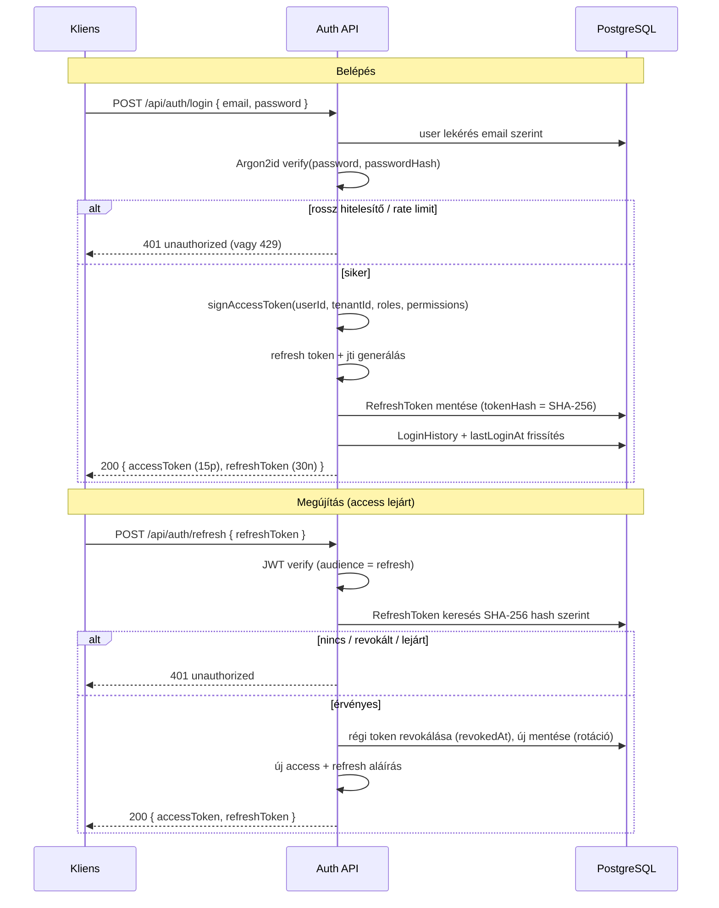

# Hitelesítési dokumentáció – Vallordocs

> Forrás: `src/modules/auth/` (PRD 2./5. fejezet – Munkamenet, Jelszavak).

A hitelesítés három építőelemből áll: **Argon2id jelszó-hash**, **rövid életű
access JWT**, és **hosszú életű, rotálódó, hash-elve tárolt refresh token**.

## Jelszó – Argon2id

`src/modules/auth/password.ts`:

- Algoritmus: **Argon2id** (`algorithm: 2`), OWASP-igazított paraméterek:
  `memoryCost = 19 456` (19 MiB), `timeCost = 2`, `parallelism = 1`.
- A jelszó soha nem tárolódik nyílt vagy visszafejthető formában.
- **Erősségi szabály** (`PASSWORD_MIN_LENGTH = 12`): legalább 12 karakter,
  tartalmaznia kell kisbetűt, nagybetűt, számjegyet és speciális karaktert
  (minden nem betű/szám speciálisnak számít).
- `checkPasswordStrength()` per-szabály visszajelzést ad dobás nélkül; a dobó
  variáns `ValidationError`-t vet.

## Tokenek – JWT (jose, HS256)

`src/modules/auth/tokens.ts`:

| Token   | TTL     | Audience             | Tartalom / tárolás                                                                            |
| ------- | ------- | -------------------- | --------------------------------------------------------------------------------------------- |
| Access  | 15 perc | `vallordocs:access`  | Stateless; `sub`=userId, `tenantId`, `roles`, `permissions` claim – autorizáció DB-kör nélkül |
| Refresh | 30 nap  | `vallordocs:refresh` | Opaque a kliensnek; `jti`; a szerver **csak SHA-256 hash-t** tárol (`RefreshToken.tokenHash`) |

- Issuer: `vallordocs`. Az audience elkülöníti az access és refresh tokent, így
  egyik sem használható a másik helyett.
- Az access token azért hordozza a `permissions` claimet, hogy az RBAC
  ellenőrzés ne igényeljen adatbázis-kört (lásd [PERMISSIONS.md](PERMISSIONS.md)).
- **Refresh rotáció:** a token minden használatkor rotálódik – a régi hash
  revokálódik (`revokedAt`), új token+hash keletkezik. Eszközönként revokálható
  (`device`, `ipAddress`, `lastUsedAt`).

## Login + refresh szekvencia

## Munkamenet / eszközök

A `users/devices.ts` az aktív munkameneteket kezeli (utolsó használat szerint
rendezve). A "kijelentkezés minden más eszközről" a jelenlegi munkamenetet nem
revokálhatja. Lásd [API.md](API.md) `/api/me/devices`.

## Kapcsolódó

- [PERMISSIONS.md](PERMISSIONS.md) – a token `permissions` claim forrása
- [DATABASE.md](DATABASE.md) – `User`, `RefreshToken`, `LoginHistory`
- [DISASTER_RECOVERY.md](DISASTER_RECOVERY.md) – `JWT_SECRET` rotáció
