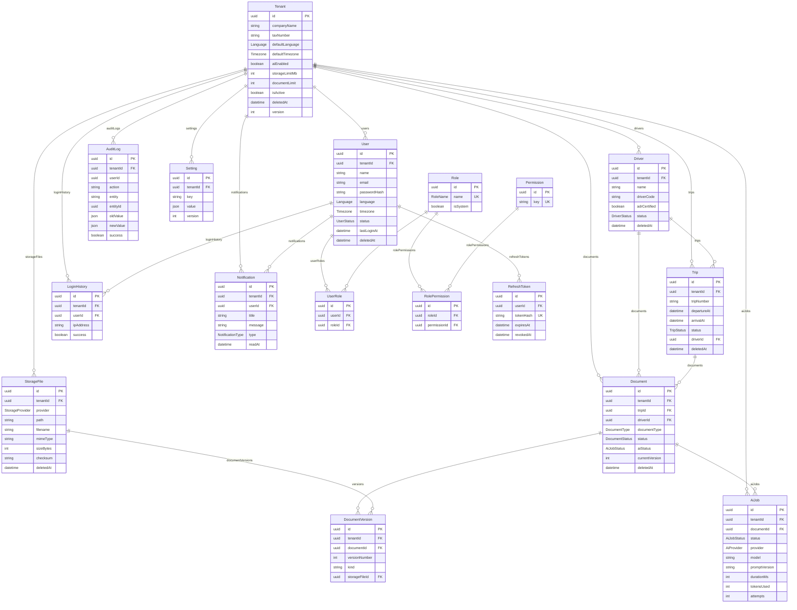

# Adatbázis dokumentáció – Vallordocs

> Forrás: `prisma/schema.prisma` (PRD 7. fejezet – Adatbázis tervezés).
> Adatbázis: PostgreSQL (Neon), ORM: Prisma.

## Alapelvek

- **Minden elsődleges kulcs UUID** (`@db.Uuid`), soha nem auto-increment.
- **Soft delete** – az alkalmazás fizikailag nem töröl. A törölhető táblák
  `deletedAt` / `deletedBy` oszlopot hordoznak; a lekérdezések `deletedAt IS NULL`
  szerint szűrnek (`tenantScope()`).
- **Audit oszlopok** – a legtöbb tábla hordozza a `createdAt`, `updatedAt`,
  `createdBy`, `updatedBy` mezőket, valamint egy optimista `version` számlálót.
- **Multi-tenant izoláció** – minden tenant-scope-olt táblának van `tenantId`
  oszlopa és arra indexe, hogy a lekérdezések mindig tudjanak tenant szerint
  szűrni.
- **Idegen kulcsok, nem cascade** – a kapcsolatokat FK modellezi; a törlés soft,
  soha nem cascade.
- Az `AuditLog` **append-only**: az alkalmazás soha nem frissíti és nem törli.

## ER diagram



## Enumok

| Enum               | Értékek                                                                                                              |
| ------------------ | -------------------------------------------------------------------------------------------------------------------- |
| `Language`         | `hu`, `ro`                                                                                                           |
| `Timezone`         | `Europe/Budapest`, `Europe/Bucharest`                                                                                |
| `UserStatus`       | `active`, `invited`, `suspended`, `disabled`                                                                         |
| `DriverStatus`     | `active`, `inactive`, `suspended`                                                                                    |
| `TripStatus`       | `planned`, `in_progress`, `completed`, `cancelled`                                                                   |
| `RoleName`         | `platform_owner`, `platform_admin`, `tenant_admin`, `dispatcher`, `office_user`, `driver`, `read_only`               |
| `DocumentType`     | `cmr`, `invoice`, `pod`, `delivery_note`, `adr`, `weight_ticket`, `fuel_receipt`, `toll_receipt`, `customs`, `other` |
| `DocumentStatus`   | `draft`, `uploaded`, `processing`, `ready`, `failed`                                                                 |
| `AiJobStatus`      | `queued`, `processing`, `generating_pdf`, `done`, `failed`, `retrying`, `cancelled`                                  |
| `AiProvider`       | `gemini`, `openai`, `claude`, `vertexai`                                                                             |
| `StorageProvider`  | `fly`, `r2`, `s3`, `azure`, `gcs`                                                                                    |
| `NotificationType` | `info`, `success`, `warning`, `error`                                                                                |

## Modellek

Jelölés: **T** = tenant-scope-olt (`tenantId` + index), **SD** = soft-delete
(`deletedAt`/`deletedBy`), **A** = audit oszlopok + `version`.

### Tenant — `tenants` (SD, A)

A legfelső izolációs egység (cég). Mezők: `companyName`, `taxNumber`, `country`,
`city`, `address`, `logoUrl`, `defaultLanguage` (`Language`), `defaultTimezone`
(`Timezone`), `aiEnabled`, `storageLimitMb`, `documentLimit`, `isActive`.
Kapcsolatok: `users`, `drivers`, `trips`, `documents`, `auditLogs`,
`notifications`, `loginHistory`, `storageFiles`, `settings`, `aiJobs`. Index:
`isActive`.

### User — `users` (T, SD, A)

Alkalmazás-felhasználó. A `tenantId` **opcionális** – a platform-szintű
felhasználóknak nincs tenantjuk. Mezők: `name`, `email`, `phone`,
`passwordHash`, `avatarUrl`, `language`, `timezone`, `status` (`UserStatus`),
`lastLoginAt`. Kapcsolatok: `tenant?`, `userRoles`, `notifications`,
`refreshTokens`, `loginHistory`. Egyediség: `[tenantId, email]`. Indexek:
`tenantId`, `email`, `status`.

### Role — `roles`

Globális (nem tenant-scope-olt) szerep. Mezők: `name` (`RoleName`, egyedi),
`description`, `isSystem`. 7 rendszerszerep van beültetve. Kapcsolatok:
`userRoles`, `rolePermissions`.

### Permission — `permissions`

Pontozott jogosultságkulcs (pl. `document.read`, `ai.execute`). Mezők: `key`
(egyedi), `description`. Kapcsolat: `rolePermissions`. 13 permission kulcs.

### UserRole — `user_roles`

User↔Role kapcsolótábla. Egyediség: `[userId, roleId]`.

### RolePermission — `role_permissions`

Role↔Permission kapcsolótábla. Egyediség: `[roleId, permissionId]`.

### Driver — `drivers` (T, SD, A)

Sofőr. Mezők: `name`, `driverCode`, `phone`, `email`, `licenseNumber`,
`adrCertified`, `status` (`DriverStatus`). Egyediség: `[tenantId, driverCode]`.
Indexek: `tenantId`, `status`. Kapcsolatok: `trips`, `documents`.

### Trip — `trips` (T, SD, A)

Fuvar. Mezők: `tripNumber`, `orderNumber`, `originPlace`, `destination`,
`departureAt`, `arrivalAt`, `status` (`TripStatus`), `driverId?`. Egyediség:
`[tenantId, tripNumber]`. Indexek: `tenantId`, `driverId`, `status`, `createdAt`.
A `status` állapotgépet lásd az [API.md](API.md)-ben.

### Document — `documents` (T, SD, A)

Dokumentum (a domain központi entitása). Mezők: `tripId?`, `driverId?`,
`documentType` (`DocumentType`), `status` (`DocumentStatus`), `aiStatus`
(`AiJobStatus`), `currentVersion`. Kapcsolatok: `trip?`, `driver?`, `versions`,
`aiJobs`. Indexek: `tenantId`, `tripId`, `driverId`, `documentType`, `status`,
`createdAt`.

### DocumentVersion — `document_versions` (T)

Egy dokumentum verziója (pl. eredeti fotó, AI-helyreállított, PDF). Mezők:
`documentId`, `versionNumber`, `kind` (mit reprezentál), `storageFileId?`.
Egyediség: `[documentId, versionNumber]`. Indexek: `tenantId`, `documentId`.

### AiJob — `ai_jobs` (T)

Egy AI-helyreállítási feladat futása. Mezők: `documentId`, `status`
(`AiJobStatus`), `provider` (`AiProvider`, alap: `gemini`), `model`,
`promptVersion`, `startedAt`, `finishedAt`, `durationMs`, `tokensUsed`,
`errorMessage`, `attempts`. Indexek: `tenantId`, `documentId`, `status`.

### StorageFile — `storage_files` (T, SD)

Tárolt bináris objektum metaadata. A `path` soha nem publikus URL. Mezők:
`provider` (`StorageProvider`), `bucket?`, `path`, `filename`, `mimeType`,
`sizeBytes`, `checksum?`. Kapcsolat: `documentVersions`. Indexek: `tenantId`,
`checksum`.

### AuditLog — `audit_logs` (T, append-only)

Módosíthatatlan audit napló. Mezők: `userId?`, `ipAddress`, `browser`, `os`,
`device`, `action`, `entity?`, `entityId?`, `oldValue` (JSON), `newValue`
(JSON), `success`, `errorText`. A `tenantId` opcionális (platform-szintű
események). Indexek: `tenantId`, `userId`, `action`, `[entity, entityId]`,
`createdAt`.

### LoginHistory — `login_history` (T)

Belépési kísérletek naplója. Mezők: `userId?`, `ipAddress`, `browser`, `os`,
`device`, `success`. Indexek: `tenantId`, `userId`, `createdAt`.

### RefreshToken — `refresh_tokens`

Eszközönként revokálható refresh token. **Csak a SHA-256 hash tárolódik**
(`tokenHash`, egyedi). Mezők: `userId`, `expiresAt`, `device`, `ipAddress`,
`lastUsedAt`, `revokedAt`. Indexek: `userId`, `expiresAt`. Részletek:
[AUTH.md](AUTH.md).

### Notification — `notifications` (T)

Felhasználói értesítés. Mezők: `userId`, `title`, `message`, `type`
(`NotificationType`), `readAt?`. Soft-delete `deletedAt`. Indexek: `tenantId`,
`userId`, `readAt`.

### Setting — `settings` (T, A)

Tenant szintű kulcs/érték beállítás. Mezők: `key`, `value` (JSON). Egyediség:
`[tenantId, key]`. Index: `tenantId`. A validált beállításmodell:
[OBSERVABILITY.md](OBSERVABILITY.md) és a `settings` modul.

## Migrációk

Az adatmodell alapozás; a későbbi mérföldkövek **migrációval** bővítik (OCR
mezők, eCMR, workflow, billing), nem újraírással. Lokálisan:

```bash
npx prisma migrate dev --name <valtozas>
```

Produkcióban a migráció out-of-band fut (nem a konténerindításkor), lásd
[DEPLOY.md](DEPLOY.md).
