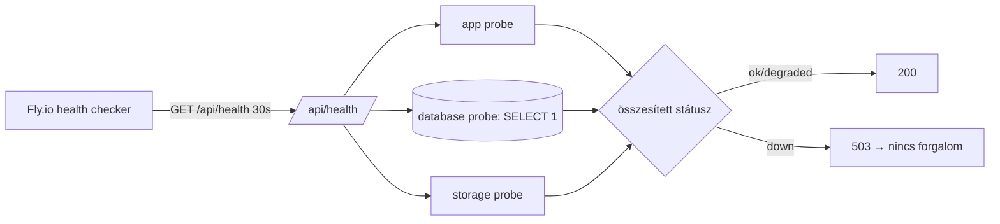

# Observability dokumentáció – Vallordocs

Ez a dokumentum a Vallordocs megfigyelhetőségét írja le: health-check, metrikák
(Prometheus/Grafana), elosztott tracing (OpenTelemetry), hibakövetés és
teljesítmény-monitorozás. PRD 5./6. fejezet – Monitoring.

Kapcsolódó: [ARCHITECTURE.md](ARCHITECTURE.md) · [DEPLOY.md](DEPLOY.md) ·
[DISASTER_RECOVERY.md](DISASTER_RECOVERY.md)

---

## 1. Health check – `GET /api/health`

A végpont a `monitoring` modul `runHealthChecks` függvényével komponál nevesített
probe-okat, mindegyikre külön időtúllépéssel, és egyetlen összesített státuszt ad:

- `ok` – minden probe rendben
- `degraded` – nem kritikus probe hibázik
- `down` – kritikus függőség elérhetetlen → HTTP **503**

Jelenlegi probe-ok: `app` (mindig ok), `database` (valós `SELECT 1` a Prisma-n
keresztül), `storage` (placeholder, amíg a live probe elkészül). A hibaüzenetek
**nem** szivárognak ki: egy hibázó probe biztonságos, általános `down` részletté
esik össze, belső hibaszöveg nélkül.

---

## 2. Metrikák – `GET /api/metrics` (Prometheus)

Az alkalmazás Prometheus szöveges exposition formátumban (v0.0.4) ad
folyamat-szintű metrikákat:

| Metrika                                    | Típus | Jelentés              |
| ------------------------------------------ | ----- | --------------------- |
| `vallordocs_process_uptime_seconds`        | gauge | Folyamat uptime       |
| `vallordocs_process_resident_memory_bytes` | gauge | RSS memória           |
| `vallordocs_process_heap_used_bytes`       | gauge | V8 heap használat     |
| `vallordocs_build_info`                    | gauge | Build info (mindig 1) |

A végpont **függőség-mentes**: egy scrape sosem bukik el amiatt, hogy egy
downstream (DB/AI) degradált – a függőségek élőségét a `/api/health` jelzi.
Későbbi bővítés: per-request számlálók (HTTP kérések, státuszkódok, latencia
hisztogram), AI-feldolgozási időhistogram, sor-mélység.

> **Fly integráció:** a `fly.toml [metrics]` blokk (`port = 9091`, `path =
"/metrics"`) a Fly-natív scrape-célt jelöli egy dedikált metrika-porton; az
> alkalmazás elsődleges Prometheus-végpontja a `/api/metrics` az app-porton.
> Éles környezetben egy Prometheus szerver ezt scrape-eli.

---

## 3. Dashboards (Grafana)

Ajánlott panelek:

- **Szolgáltatás**: uptime, health-státusz idővonal, request rate & error rate
  (RED metódus), p50/p95/p99 latencia.
- **AI pipeline**: feldolgozott dokumentumok, sikerességi arány, átlagos
  feldolgozási idő, sor-mélység, retry/dead-letter arány. Az üzleti számokat a
  `dashboard` modul is aggregálja (lásd a `/api/dashboard` végpontot).
- **Erőforrás**: memória, CPU, DB kapcsolatok, Redis.

A Grafana a Prometheus-t használja adatforrásként; a dashboardok JSON-ként
verziózhatók a repóban (jövőbeli `ops/grafana/`).

---

## 4. Elosztott tracing (OpenTelemetry)

Terv: OpenTelemetry Node SDK bekötése a Next.js `instrumentation.ts`-en keresztül,
automatikus HTTP- és Prisma-instrumentációval. Minden bejövő kérés kap egy
trace-t; a span-ök a repository-hívásokat és a külső AI/storage hívásokat fedik.
A `tenantId` és a `requestId` span-attribútumként (soha nem PII), így a trace-ek
tenant-szinten szűrhetők. Exporter: OTLP egy collectorba (Tempo/Jaeger/Honeycomb).

---

## 5. Hibakövetés (Error tracking)

- Minden nem kezelt hiba a `src/lib/http` egyetlen `errorResponse` choke-pointján
  megy át: a kliens csak biztonságos `code` + `messageKey` értéket kap, a belső
  részletek (stack, SQL, secret) nem szivárognak (lásd [ARCHITECTURE.md](ARCHITECTURE.md)).
- Szerveroldalon a részletes kontextus strukturált logba kerül (`LOG_LEVEL`),
  és egy hibakövetőbe (pl. Sentry) továbbítható – a `redactSensitive`/audit
  redakcióval összhangban, PII nélkül.
- Biztonsági és hitelesítési események az `AuditLog`-ba is kerülnek
  (`auth.login_failed`, `auth.login`, …), így a hibakövetéstől függetlenül is
  auditálhatók.

---

## 6. Teljesítmény-monitorozás és optimalizációk

A PRD teljesítmény-elvei, amelyeket a rendszer követ:

| Optimalizáció                 | Megvalósítás                                                                                                       |
| ----------------------------- | ------------------------------------------------------------------------------------------------------------------ |
| Server Components             | Alapértelmezett a Next.js App Routerben; kliens komponens csak ahol interakció kell (pl. `RegisterServiceWorker`). |
| Lazy loading / dynamic import | Nehéz, ritkán használt kliens-modulok `next/dynamic`-kal.                                                          |
| Image optimization            | `next/image`, a beszkennelt dokumentum-previeweknél.                                                               |
| Caching                       | Statikus tartalom cache-first a service workerben; API-válaszok `force-dynamic` ahol tenant-adat.                  |
| Pagination                    | A repository réteg minden lista-lekérdezést `MAX_PAGE_SIZE`-ra korlátoz – nincs korlátlan scan.                    |
| Virtualization                | Nagy listák (dokumentumok, audit) virtualizált renderrel a UI-ban.                                                 |

A latencia és hibaarány a Prometheus metrikákból és a tracing-ből követhető;
riasztás a health `down`/`degraded` átmenetekre és a hibaarány-küszöbökre.

---

## Kapcsolódó dokumentumok

- [DEPLOY.md](DEPLOY.md) – health check a rollout-ban, metrika-port
- [DISASTER_RECOVERY.md](DISASTER_RECOVERY.md) – incidens diagnózis
- [API.md](API.md) – `/api/health`, `/api/metrics`, `/api/dashboard`
