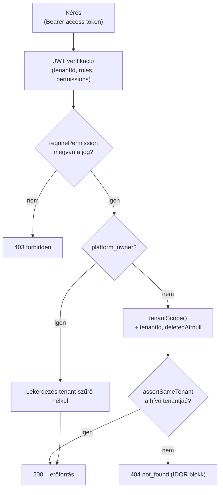

# Jogosultsági dokumentáció – Vallordocs

> Forrás: `src/modules/auth/rbac.ts` és `src/modules/tenants/tenant-context.ts`
> (PRD 2. fejezet – RBAC, Multi-Tenant).

A hozzáférés-vezérlés két, egymást kiegészítő rétegből áll:

1. **RBAC** – szerep alapú jogosultság, dotted `resource.action` kulcsokkal.
2. **Tenant-izoláció** – minden lekérdezés a hívó tenantjára szűrődik, és az
   IDOR ellen `assertSameTenant` véd.

Alapelv: **minden backend művelet a szerveren autorizál.** A frontend
ellenőrzés önmagában soha nem elegendő.

## Szerepek (7)

| Szerep (`RoleName`) | Leírás                                                                                                           |
| ------------------- | ---------------------------------------------------------------------------------------------------------------- |
| `platform_owner`    | Teljes hozzáférés; az egyetlen szerep, amely a tenant-szűrőt megkerüli                                           |
| `platform_admin`    | Platform-adminisztráció (tenantok, felhasználók, audit) – a platform titkos anyagát ezen a rétegen nem kapja meg |
| `tenant_admin`      | Egy tenant teljes körű adminisztrációja                                                                          |
| `dispatcher`        | Diszpécser: fuvarok, sofőrök, dokumentumok kezelése + AI                                                         |
| `office_user`       | Irodai olvasó: dokumentum/fuvar/sofőr olvasás                                                                    |
| `driver`            | Sofőr: saját dokumentumfeltöltés + fuvar olvasás                                                                 |
| `read_only`         | Csak olvasás (dokumentum/fuvar/sofőr/audit)                                                                      |

## Jogosultságkulcsok (13)

| Kulcs             | Jelentés                        |
| ----------------- | ------------------------------- |
| `document.read`   | Dokumentum olvasás              |
| `document.write`  | Dokumentum létrehozás/feltöltés |
| `document.delete` | Dokumentum (soft) törlés        |
| `trip.read`       | Fuvar olvasás                   |
| `trip.write`      | Fuvar létrehozás/módosítás      |
| `driver.read`     | Sofőr olvasás                   |
| `driver.write`    | Sofőr létrehozás/módosítás      |
| `user.manage`     | Felhasználók kezelése           |
| `tenant.manage`   | Tenant-beállítások kezelése     |
| `platform.manage` | Platform-szintű adminisztráció  |
| `ai.execute`      | AI-helyreállítás indítása       |
| `audit.read`      | Audit napló olvasás             |
| `settings.manage` | Tenant beállítások kezelése     |

## Szerep × jogosultság mátrix

Jelölés: ✅ = engedélyezve.

| Permission \ Szerep | platform_owner | platform_admin | tenant_admin | dispatcher | office_user | driver | read_only |
| ------------------- | :------------: | :------------: | :----------: | :--------: | :---------: | :----: | :-------: |
| `document.read`     |       ✅       |                |      ✅      |     ✅     |     ✅      |   ✅   |    ✅     |
| `document.write`    |       ✅       |                |      ✅      |     ✅     |             |   ✅   |           |
| `document.delete`   |       ✅       |                |      ✅      |            |             |        |           |
| `trip.read`         |       ✅       |                |      ✅      |     ✅     |     ✅      |   ✅   |    ✅     |
| `trip.write`        |       ✅       |                |      ✅      |     ✅     |             |        |           |
| `driver.read`       |       ✅       |                |      ✅      |     ✅     |     ✅      |        |    ✅     |
| `driver.write`      |       ✅       |                |      ✅      |     ✅     |             |        |           |
| `user.manage`       |       ✅       |       ✅       |      ✅      |            |             |        |           |
| `tenant.manage`     |       ✅       |                |      ✅      |            |             |        |           |
| `platform.manage`   |       ✅       |       ✅       |              |            |             |        |           |
| `ai.execute`        |       ✅       |                |      ✅      |     ✅     |             |        |           |
| `audit.read`        |       ✅       |       ✅       |      ✅      |            |             |        |    ✅     |
| `settings.manage`   |       ✅       |                |      ✅      |            |             |        |           |

> `platform_owner` az `ALL_PERMISSIONS` teljes halmazát kapja. A mátrix a
> `ROLE_PERMISSIONS` map hiteles leképezése (`src/modules/auth/rbac.ts`).

## Enforcement API

A `rbac.ts` a következő segédfüggvényeket adja:

- `permissionsForRoles(roles)` – a szerepek egyesített, deduplikált permission
  halmaza. Ezt a JWT access token hordozza (`permissions` claim), így az
  autorizáció nem igényel DB-kört.
- `can(principal, permission)` – nem dobó ellenőrzés (bool).
- `canAll` / `canAny` – több jogosultság együttes/vagylagos ellenőrzése.
- `requirePermission(principal, permission)` – hiányzó jog esetén
  `ForbiddenError`-t dob.

Extenzibilitás: új szerep vagy jogosultság felvétele **adatváltozás** ebben a
katalógusban, nem az egész appon szétszórt kódmódosítás.

## Tenant-izoláció és IDOR-védelem

`src/modules/tenants/tenant-context.ts`:

- **`tenantScope()`** – minden tenant-scope-olt lekérdezéshez hozzáadja a
  `{ tenantId, deletedAt: null }` szűrőt. Ezzel egyszerre valósul meg a
  tenant-izoláció és a soft-delete kihagyása.
- **`assertSameTenant()`** – mielőtt egy erőforrás visszatér a hívónak,
  ellenőrzi, hogy az a hívó tenantjához tartozik-e. Ez akadályozza meg az
  **IDOR** (Insecure Direct Object Reference) támadást: más tenant erőforrására
  hivatkozó ID `404`/`403`-at kap, nem az adatot.
- **`platform_owner` bypass** – az egyetlen szerep, amelynek lekérdezései nem
  kapják meg a tenant-szűrőt (kereszt-tenant platform-adminisztráció).

## Kapcsolódó

- [AUTH.md](AUTH.md) – token-tartalom, munkamenet
- [API.md](API.md) – végpontonkénti szükséges jogosultság
- [DATABASE.md](DATABASE.md) – `Role`, `Permission`, `UserRole`, `RolePermission`
