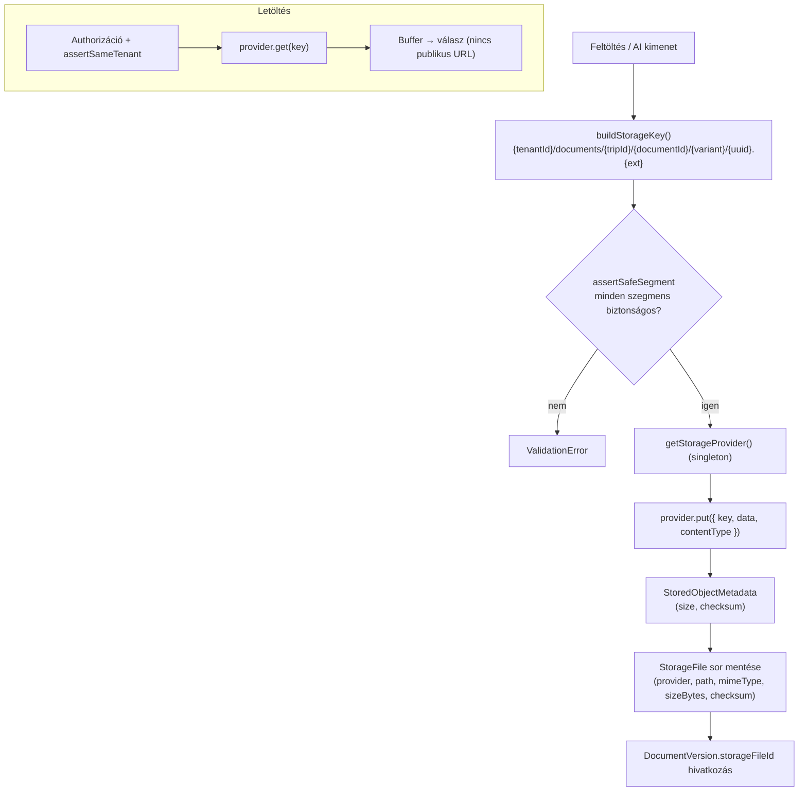

# Storage dokumentáció – Vallordocs

> Forrás: `src/modules/storage/` (PRD 3. fejezet – Storage rendszer,
> Fájlstruktúra; 5. fejezet – Storage biztonság).

Az alkalmazás **soha nem beszél közvetlenül** Fly-jal, R2-vel, S3-mal stb.
Kizárólag a `StorageProvider` interfészre támaszkodik, így a
provider-váltás konfiguráció (`STORAGE_PROVIDER` env), nem kódmódosítás. Az
objektumokat egy tenant-izolált, kitalálhatatlan kulcs címzi; a provider ezt a
kulcsot képezi le a saját háttértárára. **Nincs publikus URL** – a kulcsot a
provider oldja fel egy autorizációs ellenőrzés mögött.

## `StorageProvider` interfész

`src/modules/storage/types.ts`:

```ts
interface StorageProvider {
  readonly name: StorageProviderName; // a storage_files.provider tükre
  put(input: PutObjectInput): Promise<StoredObjectMetadata>; // méret + checksum
  get(key: string): Promise<Buffer>; // NotFoundError, ha hiányzik
  exists(key: string): Promise<boolean>;
  remove(key: string): Promise<void>; // idempotens
}
```

- `PutObjectInput`: `{ key, data: Buffer, contentType }`
- `StoredObjectMetadata`: `{ key, size, contentType, checksum }`

A `factory.ts` a `getStorageProvider()` singleton-t adja (cache-elt), a
konfiguráció alapján kiválasztva a konkrét implementációt.

## Kulcs (key) formátum

`src/modules/storage/paths.ts`:

```
{tenantId}/documents/{tripId}/{documentId}/{variant}/{uuid}.{ext}
```

- Minden tenant teljesen külön könyvtár-részfát kap → **tenant-izoláció**.
- A fájlnév **UUID-alapú** → nem kitalálható, nincs enumerálás/ütközés.
- **Variánsok** (`STORAGE_VARIANTS`): `original`, `processed`, `pdf`,
  `thumbnail`, `preview`.
- **Path traversal védelem:** minden szegmens a `^[A-Za-z0-9._-]+$` mintára
  illeszkedik; a `.`, `..`, `/`, `\` tiltott (`assertSafeSegment` →
  `ValidationError`). A `buildStorageKey` friss random UUID-t generál.

## Providerek

| Provider      | `StorageProvider` enum | Státusz          | Megjegyzés                                                                    |
| ------------- | ---------------------- | ---------------- | ----------------------------------------------------------------------------- |
| Fly Volume    | `fly`                  | ✅ Implementált  | `fly-volume-provider.ts`, path-traversal védelemmel, `FLY_STORAGE_PATH` alatt |
| Cloudflare R2 | `r2`                   | Stub / tervezett | `.env.example`: `R2_ACCOUNT_ID/ACCESS_KEY/SECRET_KEY/BUCKET`                  |
| AWS S3        | `s3`                   | Stub / tervezett | S3-kompatibilis                                                               |
| Azure Blob    | `azure`                | Stub / tervezett |                                                                               |
| Google GCS    | `gcs`                  | Stub / tervezett |                                                                               |

Az enum minden providert ismer, de **M3-ban csak a `fly` implementált**; a
többi konfigurációs bővítési pont.

## Tárolási folyamat



## Adatmodell-kapcsolat

A tárolt objektum metaadata a `StorageFile` táblában él (`provider`, `path`,
`filename`, `mimeType`, `sizeBytes`, `checksum`); a `DocumentVersion.storageFileId`
hivatkozik rá. Lásd [DATABASE.md](DATABASE.md).

## Konfiguráció

| Env                | Jelentés                                 |
| ------------------ | ---------------------------------------- |
| `STORAGE_PROVIDER` | `fly` (impl.) \| `r2`/`s3`/`azure`/`gcs` |
| `FLY_STORAGE_PATH` | Fly Volume könyvtár, pl. `/data/storage` |
| `R2_*`             | Csak `STORAGE_PROVIDER=r2` esetén        |

## Kapcsolódó

- [AI.md](AI.md) – milyen variánsok keletkeznek
- [BACKUP.md](BACKUP.md) – storage mentés
- [DISASTER_RECOVERY.md](DISASTER_RECOVERY.md) – storage visszaállítás
